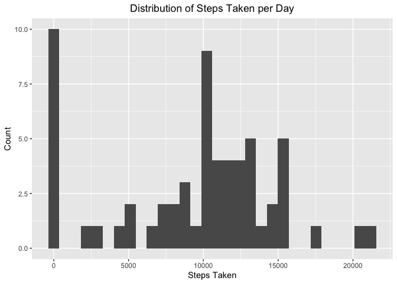
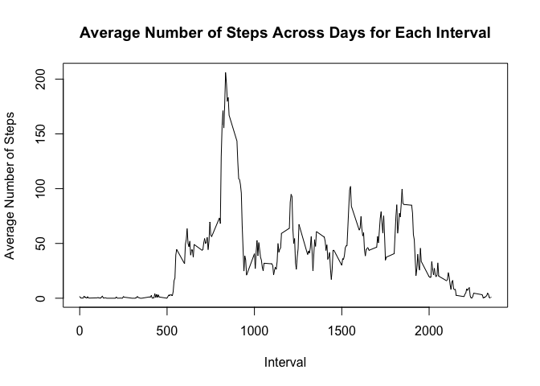
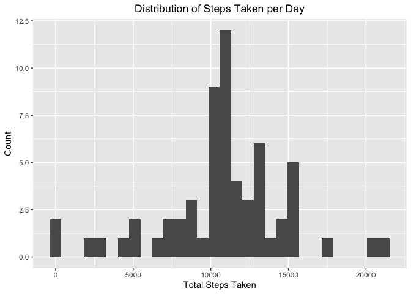
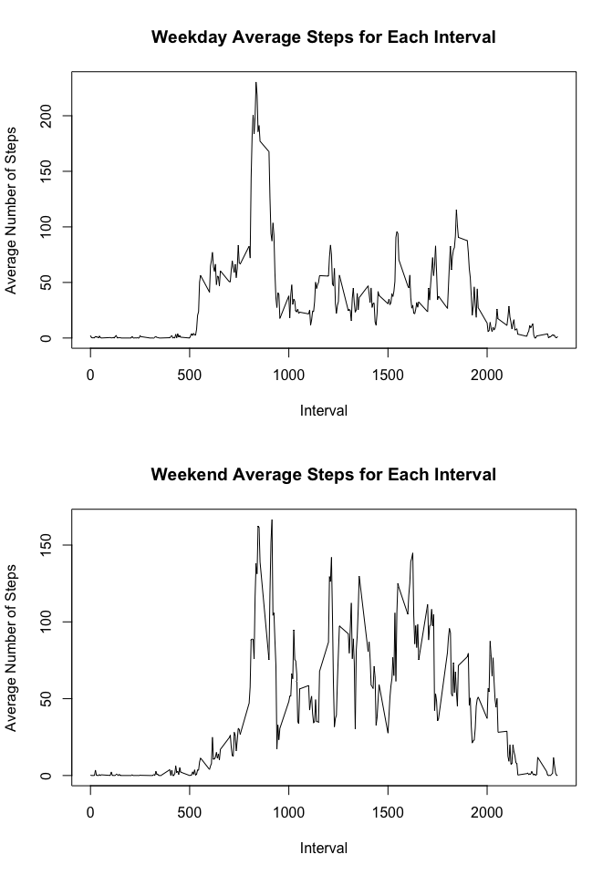

## Loading and preprocessing the data

First, the data file is unzipped, and the data is
stored in a variable called "act_raw".


```r
unzip("activity.zip")
act_raw <- read.csv("activity.csv", sep = ",")
```

Packages for data analysis and transformation are loaded:


```r
library(dplyr)
```

```
## 
## Attaching package: 'dplyr'
```

```
## The following objects are masked from 'package:stats':
## 
##     filter, lag
```

```
## The following objects are masked from 'package:base':
## 
##     intersect, setdiff, setequal, union
```

```r
library(ggplot2)
```

## What is mean total number of steps taken per day?

First, calculate and the total number of steps taken each day.


```r
steps_by_day <- act_raw %>% group_by(date) %>%
                summarise(day_sum = sum(steps, na.rm = T))
```

Next, we'll create a histogram of the steps taken on each day:


```r
steps_by_day %>% ggplot(aes(day_sum)) +
    geom_histogram() +
    labs(x = "Steps Taken", y = "Count", 
    title = "Distribution of Steps Taken per Day") +
    theme(plot.title = element_text(hjust = 0.5))
```

```
## `stat_bin()` using `bins = 30`. Pick better value with `binwidth`.
```

<!-- -->

...and then calculate the mean and median number of steps taken per day


```r
steps_mean <- mean(steps_by_day$day_sum)
steps_median <- median(steps_by_day$day_sum)
```

The mean number of steps taken in a day is 9354.2295082 and the median number
of steps taken in a day is 10395.

## What is the average daily activity pattern?

In order to calculate the average daily activity pattern, we can use group_by
with interval (removing NAs):


```r
interval_means <- act_raw %>% group_by(interval) %>% 
    summarise(avg = mean(steps, na.rm = TRUE))

with(interval_means, plot(interval, avg, type = "l",
            ylab = "Average Number of Steps", xlab = "Interval",
            main = "Average Number of Steps Across Days for Each Interval"))
```

<!-- -->

We can also calculate the interval with the maximum average number of steps
taken:


```r
max_interval <- interval_means$interval[which.max(interval_means$avg)]
```

The interval with the greatest average steps is interval 835.

## Imputing missing values

First, the goal is to identify the number of columns with at least one NA value
in the data set.


```r
na_vect <- act_raw %>% 
            filter(is.na(steps) | is.na(date) | is.na(interval))

na_count <- nrow(na_vect)
```

The total number of observations with missing values is 2304.

Let's impute the missing values for each interval by replacing missing values
with the mean for that interval across all days.


```r
imputed <- act_raw

for (i in 1:nrow(act_raw)) {
    if (is.na(act_raw$steps[i])) {
        imputed$steps[i] <- interval_means$avg[match(act_raw$interval[i],
                                                     interval_means$interval)]
    }
}
```

Next, we'll generate a histogram of the imputed dataset so that we can compare
it to the dataset with NA values removed.


```r
isteps_by_day <- imputed %>% group_by(date) %>% 
    summarise(tot_steps = sum(steps)) 

isteps_by_day %>% ggplot(aes(tot_steps)) +
        geom_histogram() +
        labs(x = "Total Steps Taken", y = "Count", 
                       title = "Distribution of Steps Taken per Day") +
        theme(plot.title = element_text(hjust = 0.5))
```

```
## `stat_bin()` using `bins = 30`. Pick better value with `binwidth`.
```

<!-- -->
Finally, we'll calculate the mean and median total steps per day:


```r
isteps_mean <- mean(isteps_by_day$tot_steps)
isteps_median <- median(isteps_by_day$tot_steps)
```

The mean number of steps per day in the imputed dataset is 1.0766189\times 10^{4} 
compared to 9354.2295082 in the original data set and the median number of 
steps per day in the imputed data is 1.0766189\times 10^{4} compared to 
10395 in the original dataset. Both the mean and median values in
the imputed data set are slightly increased due to the elimination of 8 of the
10 days that previously had total step counts of zero.

## Are there differences in activity patterns between weekdays and weekends?

In order to differentiate days as weekdays or weekends, a new feature must be
added to the dataset:


```r
imputed_dt <- imputed %>% mutate(day_type = as.factor(ifelse(
            weekdays(as.Date(imputed$date)) == "Saturday" | 
                weekdays(as.Date(imputed$date)) == "Sunday", "weekend", 
            "weekday")))
```

Finally, we create a plot comparing the mean steps for each interval on 
weekdays vs weekends:


```r
dt_interval_means <- imputed_dt %>% group_by(day_type, interval) %>% 
                    summarise(avg = mean(steps, na.rm = TRUE))
```

```
## `summarise()` has grouped output by 'day_type'. You can override using the `.groups` argument.
```

```r
weekday_steps <- dt_interval_means %>% filter(day_type == "weekday")
weekend_steps <- dt_interval_means %>% filter(day_type == "weekend")

par(mfrow = c(2,1))

with(weekday_steps, plot(interval, avg, type = "l",
            ylab = "Average Number of Steps", xlab = "Interval",
            main = "Weekday Average Steps for Each Interval"))

with(weekend_steps, plot(interval, avg, type = "l",
            ylab = "Average Number of Steps", xlab = "Interval",
            main = "Weekend Average Steps for Each Interval"))
```

<!-- -->


